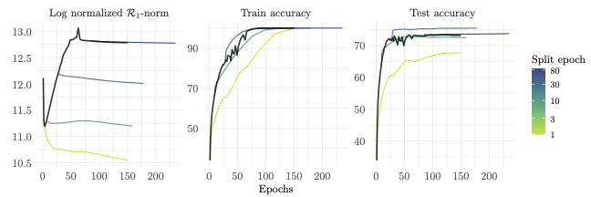

# Intrinsic dimensionality and generalization properties of the $\mathcal{R}$-norm implicit bias

This repository contains the official codebase of our --paper--.


We build on experiments from [DSBB19](https://arxiv.org/abs/1906.06766) to convert a convolutional network (CNN) to its equivalent locally-connected network (eLCN), at different stages and provide evidence for low norm implicit bias of SGD.



# Requirements

To install requirements :
```pip install -r requirements.txt```

Our resutls were obtained in Python 3.9.7 environment.

# Generate Results
Python files can be used to generate the experiments. It stores networks weights at designated epochs into a ```./results``` directory structured as the following:
- CNN weights at every epoch
- LCN detaching from CNN at certain epochs are stored under 'skinnyprime_lc_version_<split epoch>' directory.  
- Relevant historical data are stored in `evaluation-history.hist` at the end of training of each network.

```python experiments.py --epochs <num epochs> --n_splits <num splits> --cnn_lr <CNN learning rate> --lc_lr <LCN learning rate> --exec <execution flag>```

| Arguments  | Interpretation | Default values |
|------------|----------------|-----------------|
| epochs     | Number of epochs| 150 |
| n_splits   | number of splits used to produce (almost) logarithmically spaced epochs for translation from CNN to eLCN| 20 |
| cnn_lr     | CNN learning rate| 0.1 |
| lcn_lr     | LCN learning rate| 0.005|
| exec       | Execution flag   | 1   |

To run our experiments in parallel (with GPUs) on a Slurm based cluster use:
```./run_all.sh```
or,
```./job.sh```


